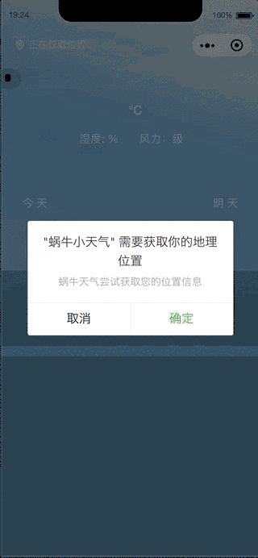
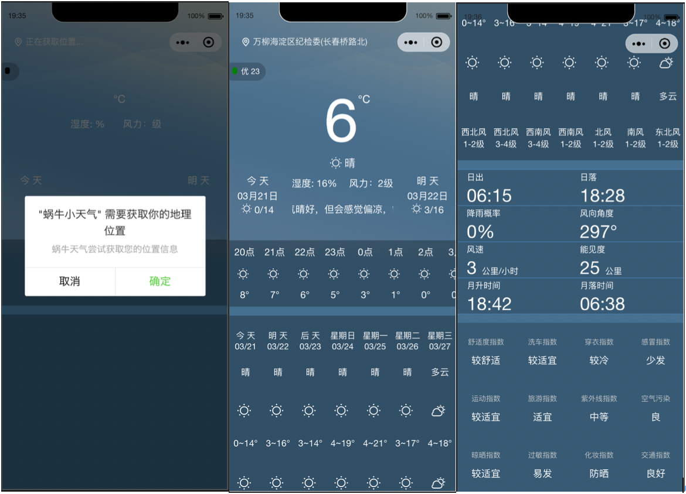

## 打开小程序的大门---一款天气小程序的诞生(蜗牛小天气)

> ———— 润物无声，做一个有个格调的coder

> **小程序、快应用**现在可谓是家喻户晓，也更加密切的渗透入我们的生活中，笔者也算是个爱折腾的人，俗话说的好嘛，“不折腾，不前端“（当然是笔者自己的小心声）。于是在平日里忙碌的工作之余抽出来时间搞点事(si)情,来写一个属于自己的贴身小天气。说时迟那时快，这就来了...

经过两三年的发展，小程序的地位也步步高升，由腾讯领队的腾讯小程序，再到后来的支付宝，美团，头条等也都相应推出自家的小程序平台，都想顺着潮流抓住流量分一杯羹，可谓是兵家必争之地。大环境的改变，为了提高小程序的快速迭代和多人合作开发的效率，也使得各大厂商都开源了自己的小程序框架，[mpvue](https://github.com/Meituan-Dianping/mpvue)、[wepy](https://tencent.github.io/wepy)、[MINA](https://developers.weixin.qq.com/miniprogram/dev/framework/MINA.html)、[Taro](http://taro.aotu.io/)等相信大家也比较熟悉了。而小程序的社区也变得跟丰富健壮，也衍生出很多精美的UI框架。有兴趣的可以自行去相应的官网了解详情。

虽然上面介绍了那么多的框架，而本次笔者并没有使用框架，而是用原生的小程序来开发今天的主角，也希望能够用原始的方式来给那些和笔者一样的刚刚入门的小程序开发者一些帮助，也将自己所学的记录下来。毕竟原生才是最底层的基础，所有的框架都是在原生的基础上开花结果的，这样才能以不变应万变(吼吼~)。笔者水平有限，有错误或者解释不当的地方还望各位看官多多包涵。

## 蜗牛小天气  效果图
**项目源码** [润物无声github](https://github.com/liuchengying/wxWeather)



## 概况


在定位功能中，本程序用到**腾讯地图**的api
相应的天气接口中，本程序用到的是**和风天气**提供的api
> 两者都需要到官网中注册开发者账号，通过注册后得到的appKey来请求我们需要的数据，详细注册步骤请自行度娘
> 
由于需要用到定位功能，而小程序本身的getLocation方法获取到的是当前位置的坐标：
``` javascript
    wx.getLocation({
      type: 'gcj02', // 返回坐标的格式
      success: res => {
          // 此处只能获取到当前位置的经纬度（坐标）
      },
    })
```
所以需要利用腾讯地图Api，通过坐标点反向获得该地点的详细信息。
##### 基本配置
在app.json中是对整个小程序的一些基本配置
``` json
    {
    "pages": [
        "pages/index/index" // 当前小程序的主入口页面
    ],
    // 主窗口的一些配置，如下，对背景颜色和小程序顶部的导航栏的样式进行了配置
    "window": {
        "backgroundColor": "#A7CAD3", 
        "backgroundTextStyle": "dark",
        "navigationBarBackgroundColor": "#A7CAD3",
        "navigationBarTitleText": "蜗牛天气",
        "navigationBarTextStyle": "black",
        "navigationStyle":"custom"
    },
    "permission": {
        "scope.userLocation": {
        "desc": "蜗牛天气尝试获取您的位置信息" // 询问用户是否可以得到获取位置权限的提示文字
        }
    }
}
```
接下来，我们就来一步一步的实现这个小程序吧~~
## 1.界面

由于没有UI，再加上笔者扭曲的审美能力（坐在屏幕前开始愣神，陷入沉思...）,所以还望各位看官多忍耐笔者又想又借鉴的界面成果...看来以后要多加强这方面的能力(haha~)

好了言归正传，首先，准备用一个页面来解决战斗，那就是各位看到以上的这个页面(都说了是‘小天气’嘛)，页面一共分为五个部分，实时天气、24小时内天气情况、未来一星期内天气情况、今天日落日出风向降雨等相关信息和天气的生活指数，这五个部分组成了整个页面，其对应的相应布局见一下代码
``` html
<view class="container" style='background: url({{bgImgUrl}}) center -200rpx / 100% no-repeat #62aadc;'>
    <view style='margin-top: -150rpx; padding-top: 150rpx;background: rgba(52,73,94, {{apl}})'>
      <view class='animation-view'>
      <!-- 当前定位信息显示 -->
        <view class='location' bind:tap="chooseLocation">
          <myicon class="icon" type="dingwei"></myicon>
          <text class='city'>{{position}}</text>
        </view>
        <!-- 通过canvas画出当前天气情况动画 -->
        <canvas canvas-id='animation' ></canvas>
        <!-- 实时天气情况 -->
        <view class="center-container">
        ...  
        </view>
        <!-- 24小时内天气情况 -->
        <view class="all-day-list">
          <scroll-view class="scroll-view_x" scroll-x>
            <view class="all-day-list-item" wx:for="{{everyHourData}}" wx:key="item.time">
              <view class="day-list-item">{{item.time}}点</view>
              <view class="day-list-item">
                <myicon type="{{item.iconType}}"></myicon>
              </view>
              <view class="day-list-item">{{item.tmp}}°</view>
            </view>
          </scroll-view>
        </view>
      </view>
        <!-- 一星期内天气 -->
      <view class="one-week-list">
        <view class="one-week-list-item" wx:for="{{everyWeekData}}" wx:key="item.weekday">
          <view class="week-list-item">
            <view>{{item.weekday}}</view>
            <view>{{item.date}}</view>
          </view>
          <view class="week-list-item">{{item.cond_txt_d}}</view>
          <view class="week-list-item">
            <myicon type="{{item.iconTypeBai}}"></myicon>
          </view>
          <view class="week-list-item">{{item.tmp_min}}~{{item.tmp_max}}°</view>
          <view class="week-list-item">
            <myicon type="{{item.iconTypeYe}}"></myicon>
          </view>
          <view class="week-list-item">{{item.cond_txt_n}}</view>
          <view class="week-list-item" style="font-size: 28rpx">
            <view>{{item.wind_dir == '无持续风向' ? '无' : item.wind_dir}}</view>
            <view>{{item.wind_sc}}级</view>
          </view>
        </view>

      </view>
        <!-- 日出日落风向降雨概率等 -->
      <view class='live-index-view'>
        ...
      </view>
        <!-- 生活指数 -->
      <view class='last-view'>
        <view class='last-view-item' wx:for="{{lifeStyle}}" wx:key="item.type">
          <view class='last-view-item-top'>{{lifeEnum[item.type]}}</view>
          <view class='last-view-item-bottom'>{{item.brf}}</view>
        </view>
      </view>
    </view>
</view>

```
具体 **css** 样式，详见 [蜗牛小天气](https://github.com/liuchengying/wxWeather) 源码

> 注意：(笔者入坑，一开始使用的纵向的scroll-view，后来无奈的用了原来页面的滚动)
> **scroll-view:** *具体属性参考小程序官方文档*
> 在小程序中，内部为我们提供了scroll-view这个页面滚动的组件，对性能进行了一些优化，方便我们的使用。与此同时，也会有一些小坑
> * 在使用scroll-view是，如果是纵向（Y轴）滚动，scroll-y属性，则必须为此scroll-view设置一个固定(明确)的高
> * 请勿在scroll-view组件标签内使用 textarea、map、canvas、video等组件
> * 在使用了scroll-view组件时会阻止页面的回弹效果，也就是在scroll-view中滚动，无法触发onPullDownRefresh方法
> * 如果想使用原生的下拉刷新（非自定义）或者双击顶部页面回滚到页面顶部，请不要使用scroll-view。

相信各位看官发现了以上代码中有一个\<myicon> 的标签，此标签为一个图标组件，因为蜗牛天气中用到的图标也比较多。接下来我们说明下有关组件的封装事宜。为了提高代码的复用性和易维护性，以及多人合作开发的效率，组件化似乎是一个很好的解决办法，在微信小程序中，每个页面由四个文件组成
* *.wxml    ----文档结构 => 等同于html
* *.js     ----处理业务逻辑
* *.json    ----当前页面或组件的一些配置和选项
* *.wxss    ----样式文件 => 等同于css

而对于本小程序中\<myicon>组件来说
``` html
<!-- 仅有一个text标签，通过type属性来改变字符图标的类型（多云，小雨...） -->
<!-- 字符图标通过css样式和自定义字体来实现，通过class来显示不同类型的图标字体 -->
<!-- 具体自定义字体图标制作过程可参考此链接 https://blog.csdn.net/thatway_wp/article/details/79076023 -->
<text class="icon icon-{{type}}"></text>
```
``` javascript
// 小程序中的组件，通过调用Component方法，将组件的逻辑处理部分，属性以及方法（生命周期）等一对象的方式传入Component方法中
Component({
    properties: {
      type: {
        type: String, // type属性的类型
        value: '' // 默认值
      }
    }
  });
```
使用了Component构造器，通过参数指定组件的属性，数据，方法以及生命周期中的一些方法，在此组件中定义了接受的type属性，类型为字符串，其默认值为空字符串。
``` json
{
    "component": true // 配置，当前为组件
}
```
``` javascript
// CSS 部分略过...
```
就这样，一个简单的icon图标组件就封装好了，是不是很简单啊。封装是封装好了，那么我们怎么调用这个组件呢，是不是很类似于Vue呢，没错，只需要在你调用的页面中注册一下即可
``` json
// 当前想要调用的页面的*.json文件中，如下
{
  "enablePullDownRefresh": true, // 此项与组件无关，此项为是否用小程序本身的下拉刷新功能
  "usingComponents": {
    "myicon": "../../components/icon/index" // 调用，注册icon组件
  }
}
```

## 2.相关数据API
一开始就说到了需要使用**腾讯地图**API的appkey还有**和风天气**API的appkey，笔者是将appkey配置在了config.js中，看官只需将自己相应的appkey值替换即可，由于appkey是私密的，此处就不公开了，还望谅解。
``` javascript
// config.js
export default {
    MAP_API_KEY: 'XXXXX-XXXXX-XXXXX-XXXXX-XXXXX-XXXXX', // 腾讯地图key
    WEATHER_API_KEY: 'XXXXXXXXXXXXXXXX' // 和风天气key
}
```
所有数据的接口，都定义在了api.js文件中，此处没什么好说的，看官自行通过接口文档查询。接口均采用回调的方式，笔者并没有封装成Promise的方式，如果有兴趣可自行更改。
``` javascript
// 引入config，为了后面的key
import config from '../uitl/config'
// 地图key
const mapKey = config.MAP_API_KEY
// 和风天气key
const weatherKey = config.WEATHER_API_KEY
// map url
const locationUrl = 'https://apis.map.qq.com/ws/geocoder/v1/'
//天气url
const weatherUrl = 'https://free-api.heweather.net/s6/weather/forecast'
//24小时内 每小时
const everyhoursUrl = 'https://api.heweather.net/s6/weather/hourly'
// 一周内
const everyWeekUrl = 'https://api.heweather.net/s6/weather/forecast'
//空气质量
const airQualityUrl = 'https://api.heweather.net/s6/air/now'
// 实况天气
const weatherLive = 'https://api.heweather.net/s6/weather/now'
// 生活指数
const lifeStyle = 'https://api.heweather.net/s6/weather/lifestyle'
// 根据当前位置的坐标反得到当前位置的详细信息
// lat,lon 为经纬度坐标
export const getPosition = (lat, lon, success = {}, fail = {}) => {
  return wx.request({
    url: locationUrl,
    header: {
      'Content-Type': 'application/json'
    },
    data: {
      location: `${lat},${lon}`,
      key: mapKey,
      get_poi: 0
    },
    success,
    fail
  })
}
// 根据location得到天气信息
// lat,lon 为经纬度坐标
export const getWeaterInfo = (lat, lon, success = {}, fail = {}) => {
  return wx.request({
    url: weatherUrl,
    header: {
      'Content-Type': 'application/json'
    },
    data: {
      location: `${lat},${lon}`,
      lang: 'zh',
      unit: 'm',
      key: weatherKey
    },
    success,
    fail
  })
}
// 根据location信息得到24小逐小时天气情况
// lat,lon 为经纬度坐标
export const getEveryHoursWeather = (lat, lon, success = {}, fail = {}) => {
  return wx.request({
    url: everyhoursUrl,
    header: {
      'Content-Type': 'application/json'
    },
    data: {
      location: `${lat},${lon}`,
      lang: 'zh',
      unit: 'm',
      key: weatherKey
    },
    success,
    fail
  })
}
...
... // 其他接口类似
...
}
```
## 3.实现逻辑(业务代码)
#### 3.1 流程
首先，当初次加载页面时，大体流程为首先通过定位获取位置，然后通过位置信息去得到我们需要的每一项天气信息，最后将天气信息渲染后页面中相应的位置
**具体流程**：
* 获取位置经纬度
* 通过经纬度逆向获得位置信息
* 通过位置信息获取天气信息
    * 获取实时天气信息
        * **判断是否为白天和晚上（改变页面背景）--该小程序中定义早上6点到晚上18点为浅色背景，其他时间为深色背景**
        * **判断当前天气的情况(雨或雪的大小),在实况天气界面中通过canvas模拟雨雪的动画**
    * 获取24小时天气信息
    * 获取一星期的天气信息
    * 获取生活指数信息
> 当通过手动改变位置信息时，按顺序重复执行以上步骤
#### 3.2 获取经纬度以及逆向出位置信息
通过wx.getLocation原生方法获取经纬度信息，在经过腾讯地图api通过经纬度逆向获取到相应的位置信息，对于这个项目来说获取位置信息是最重要的信息，故我们希望在页面一加载的时候就执行方法获取，然后『onLoad』方法可以帮助我们解决，这个方法就是小程序的生命周期函数--监听页面加载，此方法会在页面刚加载的时候（document文档结构渲染完成后）执行。
> 小程序页面（Page）的生命周期函数：

|   name   | type  |      functional      |
| :------: | :---: | :------------------: |
|  onLoad  | 函数  |     监听页面加载     |
| onReady  | 函数  | 监听页面初次渲染完成 |
|  onShow  | 函数  |     监听页面显示     |
|  onHide  | 函数  |     监听页面隐藏     |
| onUnload | 函数  |     监听页面卸载     |

以下为获取位置信息代码：
``` javascript
    // onLoad
    onLoad: function () {
        ...
        ...
        this.getPositon() // 调用获取位置信息
    }
    // 原生方法获取经纬度信息
    getPosition: function () {
        wx.getLocation({
            type: 'gcj02',
            success: this.updateLocation, // 成功会掉  updataLocation 方法为更新位置
            fail: err => {
                console.log(err)
            }
        })
    }
    // 更新位置信息
    updateLocation: function(res) {
        ...
        ...
        let {latitude: x,longitude: y,name} = res;
        let data = {
            location: {
                x,
                y,
                name: name || '北京市'
            },
            ...
            ...
        };
        this.setData(data); // 设置page中data对象中的属性
        // 通过经纬度逆向获得位置信息
        this.getLocation(x, y, name);
  }
  // 逆向获取位置信息
  getLocation: function(lat, lon, name) {
    wx.showLoading({
      title: "定位中",
      mask: true
    })
    // 腾讯地图api接口
    getPosition(lat, lon, (res) => {
        if (res.statusCode == 200) {
            let response = res.data.result
            let addr = response.formatted_addresses.recommend || response.rough
            this.setData({
                position: addr // 赋值给 data对象中的相应属性
            })
            wx.hideLoading()
            this.getData(lat, lon);
        }
        }, (err => {
        console.log(err)
        wx.hideLoading()
        }))
  },
    // 当用户点击显示定位处的view时，会调用原生的chooseLocation方法，内部调用选择位置页面
    chooseLocation: function() {
        wx.chooseLocation({
            success: res => {
                let {latitude,longitude} = res
                let {x,y} = this.data.location
                if (latitude == x && longitude == y) {

                } else {
                    this.updateLocation(res)
                }
            }
        })
    },
```
##### setData方法
上面代码中两次用到了setData方法，该方法接受一个对象，对象中的属性为需要改变的数据，同时接受一个callback函数，用于通过改变数据更新页面渲染完成之后的回调。我们来看看data的作用。
``` javascript
    page({
        data: {
            backgroundColor：'red',
            fontSize: '20',
            ...
            ...
        }
    })
```
在page中，data中的属性是连接**逻辑层**和**视图层**的一个桥梁，也就是说我们可以通过js代码的逻辑来控制data中的属性的值，而页面中的一部分显示内容是根据data中的属性的值而变化。这也就是我们所说的mvvm模型，我们只需把重心放在js逻辑层，而无需去频繁的手动的操作视图层。了解了data的作用，再来说setData，setData就是在js逻辑层中去改变和设置data中的属性的值，从而使页面得到响应。
``` javascript
    ...
    this.setData({
        backgroundColor: 'green' // 改变背景颜色属性，视图中以来此属性的会将颜色变成绿色
    })
    ...
```
> 注意：
> * 直接修改this.data的值，而不是通过调用this.setData()方法，是无法成功改变页面的状态的
> * 仅仅支持JSON化的数据（key：value）
> * 单词设置的值不能超过1024K，所以使用的时候尽量不要一次设置过多的数据
> * 不要把data中的任何一项value值设置成undefined，否则这一项将不能被设置，也可能会有其他问题
> * 不要频繁的去调用this.setData()方法去设置同一个值或者多个值，比如通过在循环中调用this.setData(),这样会导致性能损耗

#### 3.3 获取天气
通过上面获得到的位置信息，用来调用相应的接口获得当前位置的天气。方法接口已在前面封装好，直接调用然后通过对response进行过滤或者重组等来满足当前的应用，最后通过this.setData()方法去更新数据是页面得到响应。
> * getWeather(lat, lon) // lat, lon 为当前位置的经纬度
> * getAir(lat, lon)
> * getHourWeather(lat, lon)
> * getWeatherForWeek(lat, lon)
> * getLifeIndex(lat, lon)

*以上方法不在一一列举其中数据处理的过程，可自行查看源码 详见 [蜗牛小天气](https://github.com/liuchengying/wxWeather) 源码*

##### 关于canvas画出模拟雨和雪的粒子动画效果
粒子动画在现在越来越多的项目中被用到。从静态到动态最后再到仿真效果更好的视觉体验，也是人们在视觉上追求极致的体验。我们通过粒子，也就是通过点和线，来模拟出雨和雪的效果。通过小程序中的canvas画布来画出我们想要的效果。
实现原理：
* 首先我们通过点和线来模拟雨滴下落和雪花飘落
* 我们通过在同一时间同一块区域(也就是此小程序页面中实况天气的区域)中雨滴或雪花的多少来表示大小
* 构造一个总的Weather基类，来设置画布的width，height，以及雨滴或雪花的数量，同时会有两个Start和Stop方法（也就是开始和停止方法）
* 构造一个Rain类和一个Snow类，都继承自Weather类，Rain和Snow都有自己私有的 _init(初始化), _drawing（画）, _update（更新画布）三个方法来控制Rain和Snow的动作

#### Weather类
Weather类是一个基类，主要处理画布的一些信息，例如width，height，定时器，以及当前动画的状态（status）等
``` javascript
    const STOP_ANIMATION = 'stop'
    const START_ANIMATION = 'start'

    class Weather {
        constructor(context, width, height, option = {}) {
            this.opt = option || {}
            this.context = context
            this.timer = null
            this.status = STOP_ANIMATION
            this.width = width
            this.height = height
            this._init()
        }
        // 实例调用此方法，开始在画布上画
        start() {
            if(this.status !== START_ANIMATION) {
                this.status = START_ANIMATION
                this.timer = setInterval(() => {
                    this._drawing()
                }, 30)
            return this
            }
        }
        stop() {
            this.status = STOP_ANIMATION
            clearInterval(this.timer)
            this.timer = null
            return this
        }
    }

    export default Weather
```
#### Rain类
Rain类继承自Weather类，通过_init方法和父类中画布参数，以及option参数中的counts(雨滴数量)来初始化。
``` javascript
import Weather from './Weather.js'
class Rain extends Weather {
    // 初始化
  _init() {
    this.context.setLineWidth(2)
    this.context.setLineCap('round')
    let height = this.height
    let width = this.width
    let counts = this.opt.counts || 100
    let speedCoefficient = this.opt.speedCoefficient
    let speed = speedCoefficient * height
    this.animationArray = []
    let arr = this.animationArray

    for (let i = 0; i < counts; i++) {
      let d = {
        x: Math.random() * width,
        y: Math.random() * height,
        len: 2 * Math.random(),
        xs: -1,
        ys: 10 * Math.random() + speed,
        color: 'rgba(255,255,255,0.1)'
      }
      arr.push(d)
    }
  }
 // 开始画
  _drawing() {
    let arr = this.animationArray
    let ctx = this.context
    ctx.clearRect(0, 0, this.width, this.height)
    for (let i = 0; i < arr.length; i++) {
      let s = arr[i]
      ctx.beginPath()
      ctx.moveTo(s.x, s.y)
      ctx.lineTo(s.x + s.len * s.xs, s.y + s.len * s.ys)
      ctx.setStrokeStyle(s.color)
      ctx.stroke()
    }
    ctx.draw()
    return this.update()
  }
// 更新画布
  update() {
    let width = this.width
    let height = this.height
    let arr = this.animationArray
    for (let i = 0; i < arr.length; i++) {
      let s = arr[i]
      s.x = s.x + s.xs
      s.y = s.y + s.ys
      if (s.x > width || s.y > height) {
        s.x = Math.random() * width
        s.y = -10
      }
    }
  }
}

export default Rain
```
#### Snow类
Snow类继承自Weather类，通过_init方法和父类中画布参数，以及option参数中的counts(雪花数量)来初始化。
``` javascript
import Weather from './Weather.js'
class Snow extends Weather {
    // 初始化
  _init() {
    let {
      width,
      height
    } = this
    console.log(width)
    let colors = this.opt.colors || ['#ccc', '#eee', '#fff', '#ddd']
    let counts = this.opt.counts || 100

    let speedCoefficient = this.opt.speedCoefficient || 0.03
    let speed = speedCoefficient * height * 0.15

    let radius = this.opt.radius || 2
    this.animationArray = []
    let arr = this.animationArray

    for (let i = 0; i < counts; i++) {
      arr.push({
        x: Math.random() * width,
        y: Math.random() * height,
        ox: Math.random() * width,
        ys: Math.random() + speed,
        r: Math.floor(Math.random() * (radius + 0.5) + 0.5),
        color: colors[Math.floor(Math.random() * colors.length)],
        rs: Math.random() * 80
      })
    }
    console.log(arr)
  }
  // 开始画
  _drawing() {
    let arr = this.animationArray
    let context = this.context
    context.clearRect(0, 0, this.width, this.height)
    for (let i = 0; i < arr.length; i++) {
      let {
        x,
        y,
        r,
        color
      } = arr[i]
      context.beginPath()
      context.arc(x, y, r, 0, Math.PI * 2, false)
      context.setFillStyle(color)
      context.fill()
      context.closePath()
    }

    context.draw()
    this._update()
  }
  // 更新画布
  _update() {
    let {
      width,
      height
    } = this
    let arr = this.animationArray
    let v = this.opt.speedCoefficient / 10
    for (let i = 0; i < arr.length; i++) {
      let p = arr[i]
      let {
        ox,
        ys
      } = p
      p.rs += v
      p.x = ox + Math.cos(p.rs) * width / 2
      p.y += ys
      if (p.x > width || p.y > height) {
        p.x = Math.random() * width
        p.y = -10
      }
    }
  }
}

export default Snow
```

结束！！！

------------------------------
到此，蜗牛小天气就开发完成了，希望对各位有帮助。
希望在阅读的同时如果感觉对各位有帮助，还请看官别忘了给你大大的赞👍，码字不易...
初来乍到，能耐有限，水平一般，只是想着用文字来记录和传递一些能量。如果文中有错误之处，还请各位多多提意见，共同探讨，也请各位多包涵。
