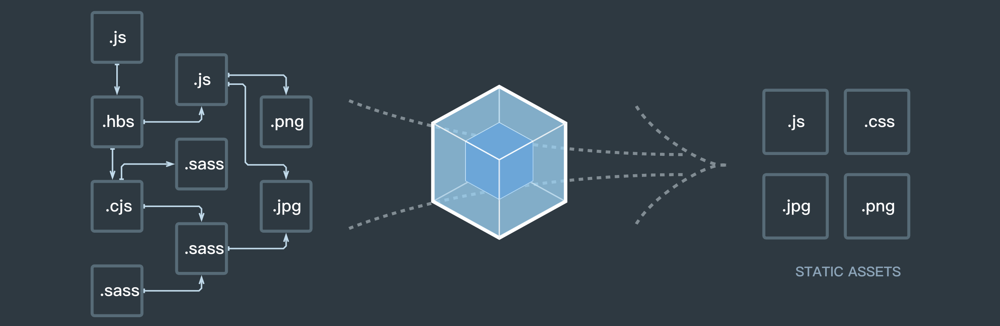
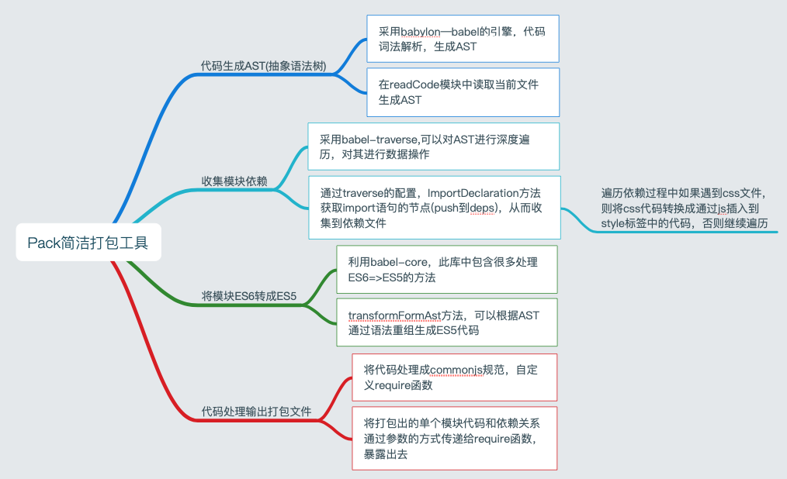

## 通过实现一个简易打包工具，分析打包的核心原理

#### 概述
眼下wepack似乎已经成了前端开发中不可缺少的工具之一，而他的一切皆模块的思想随着webpack版本不断的迭代（webpack 4）使其打包速度更快，效率更高的为我们的前端工程化服务

相信大家使用webpack已经很熟练了，他通过一个配置对象，其中包括对入口，出口，插件的配置等，然后内部根据这个配置对象去对整个项目工程进行打包，从一个js文件切入(此为单入口，当然也可以设置多入口文件打包),将该文件中所有的依赖的文件通过特定的loader和插件都会按照我们的需求为我们打包出来，这样在面对当前的ES6、scss、less、postcss就可以畅快的尽管使用，打包工具会帮助我们让他们正确的运行在浏览器上。可谓是省时省力还省心啊。

那当下的打包工具的核心原理是什么呢？今天就来通过模拟实现一个小小的打包工具来为探究一下他的核心原理喽。文中有些知识是点到，没有深挖，如果有兴趣的可以自行查阅资料。
> 功力尚浅，只是入门级的了解打包工具的核心原理，简单的功能

#### 项目地址
MiniPack：[点击github]([http](https://github.com/liuchengying/MiniPack)) 
#### 原理

当我们更加深入的去了解javascript这门语言时，去知道javascript更底层的一些实现，对我们理解好的开源项目是由很多帮助的，当然对我们自身技术提高会有更大的帮助。
javascript是一门弱类型的解释型语言，也就是说在我们执行前不需要编译器来编译出一个版本供我们执行，对于javascript来说也有编译的过程，只不过大部分情况下编译发生在代码执行前的几微秒，编译完成后会尽快的执行。也就是根据代码的执行去动态的编译。而在编译过程中通过语法和词法的分析得出一颗语法树，我们可以将它称为**AST**【**抽象语法树（Abstract Syntax Tree）也称为AST语法树，指的是源代码语法所对应的树状结构。也就是说，一种编程语言的源代码，通过构建语法树的形式将源代码中的语句映射到树中的每一个节点上。**】。而这个AST却恰恰使我们分析打包工具的重点核心。

我们都熟悉babel，他让前端程序员很爽的地方在于他可以让我们畅快的去书写ES6、ES7、ES8.....等等，而他会帮我们统统都转成浏览器能够执行的ES5版本，它的核心就是通过一个**babylon**的js词法解析引擎来分析我们写的ES6以上的版本语法来得到AST(抽象语法树)，再通过对这个语法树的深度遍历来对这棵树的结构和数据进行修改。最终转通过整理和修改后的AST生成ES5的语法。这也就是我们使用babel的主要核心。一下是语法树的示例

**需要转换的文件（index.js）**
``` javascript
    // es6  index.js
    import add from './add.js'
    let sum = add(1, 2);
    export default sum
    // ndoe build.js
    const fs = require('fs')
    const babylon = require('babylon')

    // 读取文件内容
    const content = fs.readFileSync(filePath, 'utf-8')
    // 生成 AST 通过babylon
    const ast = babylon.parse(content, {
        sourceType: 'module'
    })
    console.log(ast)
```
**执行文件(在node环境下build.js)**
``` javascript
    // node build.js
    // 引入fs 和 babylon引擎
    const fs = require('fs')
    const babylon = require('babylon')

    // 读取文件内容
    const content = fs.readFileSync(filePath, 'utf-8')
    // 生成 AST 通过babylon
    const ast = babylon.parse(content, {
        sourceType: 'module'
    })
    console.log(ast)
```
**生成的AST**
``` javascript
    ast = {
        ...
        ...
        comments:[],
        tokens:[Token {
                    type: [KeywordTokenType],
                    value: 'import',
                    start: 0,
                    end: 6,
                    loc: [SourceLocation] },
                Token {
                    type: [TokenType],
                    value: 'add',
                    start: 7,
                    end: 10,
                    loc: [SourceLocation] },
                Token {
                    type: [TokenType],
                    value: 'from',
                    start: 11,
                    end: 15,
                    loc: [SourceLocation] },
                Token {
                    type: [TokenType],
                    value: './add.js',
                    start: 16,
                    end: 26,
                    loc: [SourceLocation] },
                Token {
                    type: [KeywordTokenType],
                    value: 'let',
                    start: 27,
                    end: 30,
                    loc: [SourceLocation] },
                Token {
                    type: [TokenType],
                    value: 'sum',
                    start: 31,
                    end: 34,
                    loc: [SourceLocation] },
                ...
                ...
                Token {
                    type: [KeywordTokenType],
                    value: 'export',
                    start: 48,
                    end: 54,
                    loc: [SourceLocation] },
                Token {
                    type: [KeywordTokenType],
                    value: 'default',
                    start: 55,
                    end: 62,
                    loc: [SourceLocation] },
                Token {
                    type: [TokenType],
                    value: 'sum',
                    start: 63,
                    end: 66,
                    loc: [SourceLocation] },
            ]
   }
```
上面的示例就是分析出来的AST语法树。**babylon**在分析源代码的时候，会逐个字母的像扫描机一样读取，然后分析得出语法树。(关于语法树和babylon可以参考 https://www.jianshu.com/p/019d449a9282 。通过遍历对他的属性或者值进行修改根据相应的算法规则重新组成代码。当分析我们正常的js文件时，往往得到的AST会很大甚至几万、几十万行，所以需要很优秀的算法才能保证速度和效率。下面本项目中用到的是**babel-traverse**来解析AST。对算法的感兴趣的可以去了解一下。以上部分讲述的知识点并没有深入，原因如题目，只是要探索出打包工具的原理，具体知识点感兴趣的自己去了解下吧。原理部分大概介绍到这里吧，下面开始施实战。

## 项目目录
```
    ├── README.md
    ├── package.json
    ├── src
    │   ├── lib
    │   │   ├── bundle.js // 生成打包后的文件
    │   │   ├── getdep.js // 从AST中获得文件依赖关系
    │   │   └── readcode.js //读取文件代码，生成AST，处理AST,并且转换ES6代码
    │   └── pack.js // 向外暴露工具入口方法
    └── yarn.lock
```
**思维导图**

通过思维导图可以更清楚罗列出来思路
## 具体实现
流程梳理中发现，重点是找到每个文件中的依赖关系，我们用**deps**来收集依赖。从而通过依赖关系来模块化的把依赖关系中一层一层的打包。下面一步步的来实现
> 主要通过 代码 + 解释 的梳理过程
#### 读取文件代码
首先，我们需要一个入口文件的路径，通过node的fs模块来读取指定文件中的代码，然后通过以上提到的babylon来分析代码得到AST语法树，然后通过babel-traverse库来从AST中获得代码中含有import的模块(路径)信息，也就是依赖关系。我们把当前模块的所有依赖文件的相对路径都push到一个deps的数组中。以便后面去遍历查找依赖。
``` javascript
    const fs = require('fs')
    // 分析引擎
    const babylon = require('babylon')
    // traverse 对语法树遍历等操作
    const traverse = require('babel-traverse').default
    // babel提供的语法转换
    const { transformFromAst } = require('babel-core')
    // 读取文件代码函数
    const readCode = function (filePath) {
        if(!filePath) {
            throw new Error('No entry file path')
            return
        }
        // 当前模块的依赖收集
        const deps = []
        const content = fs.readFileSync(filePath, 'utf-8')
        const ast = babylon.parse(content, { sourceType: 'module' })
        // 分析AST，从中得到import的模块信息（路径）
        // 其中ImportDeclaration方法为当遍历到import时的一个回调
        traverse(ast, {
            ImportDeclaration: ({ node }) => {
                // 将依赖push到deps中
                // 如果有多个依赖，所以用数组
                deps.push(node.source.value)
            }
        })
        // es6 转化为 es5
        const {code} = transformFromAst(ast, null, {presets: ['env']})
        // 返回一个对象
        // 有路径，依赖，转化后的es5代码
        // 以及一个模块的id（自定义）
        return {
            filePath,
            deps,
            code,
            id: deps.length > 0 ? deps.length - 1 : 0
        }
}

module.exports = readCode
```
相信上述代码是可以理解的，代码中的注释写的很详细，这里就不在多啰嗦了。需要注意的是，babel-traverse这个库关于api以及详细的介绍很少，可以通过其他途径去了解这个库的用法。
另外需要在强调一下的是最后函数的返回值，是一个对象，该对象中包含的是当前这个文件（模块）中的一些重要信息，deps中存放的就是当前模块分析得到的所有依赖文件路径。最后我们需要去递归遍历每个模块的所有依赖，以及代码。后面的依赖收集的时候会用到。
#### 依赖收集
通过上面的读取文件方法我们得到返回了一个关于单个文件(模块)的一些重要信息。**filePath**(文件路径),**deps**(该模块的所有依赖),**code**(转化后的代码),**id**(该对象模块的id)
我们通过定义**deps**为一个数组，来存放所有依赖关系中每一个文件(模块)的以上重要信息对象
接下来我们通过这个单文件入口的依赖关系去搜集该模块的依赖模块的依赖，以及该模块的依赖模块的依赖模块的依赖......我们通过递归和循环的方式去执行readCode方法，每执行一次将readCode返回的对象push到deps数组中，最终得到了所有的在依赖关系链中的每一个模块的重要信息以及依赖。
``` javascript
    const readCode = require('./readcode.js')
    const fs = require('fs')
    const path = require('path')
    const getDeps = function (entry) {
        // 通过读取文件分析返回的主入口文件模块的重要信息  对象
        const entryFileObject = readCode(entry)
        // deps 为每一个依赖关系或者每一个模块的重要信息对象 合成的数组
        // deps 就是我们提到的最终的核心数据，通过他来构建整个打包文件
        const deps = [entryFileObject ? entryFileObject : null]
        // 对deps进行遍历 
        // 拿到filePath信息，判断是css文件还是js文件
        for (let obj of deps) {
            const dirname = path.dirname(obj.filePath)
            obj.deps.forEach(rPath => {
                const aPath = path.join(dirname, rPath)
                if (/\.css/.test(aPath)) {
                    // 如果是css文件，则不进行递归readCode分析代码，
                    // 直接将代码改写成通过js操作写入到style标签中
                    const content = fs.readFileSync(aPath, 'utf-8')
                    const code = `
                    var style = document.createElement('style')
                    style.innerText = ${JSON.stringify(content).replace(/\\r\\n/g, '')}
                    document.head.appendChild(style)
                    `
                    deps.push({
                        filePath: aPath,
                        reletivePaht: rPath,
                        deps,
                        code,
                        id: deps.length > 0 ? deps.length : 0
                    })
                } else {
                    // 如果是js文件  则继续调用readCode分析该代码
                    let obj = readCode(aPath)
                    obj.reletivePaht = rPath
                    obj.id = deps.length > 0 ? deps.length : 0
                    deps.push(obj)
                }
            })
        }
        // 返回deps
        return deps
    }

module.exports = getDeps
```
可能在上述代码中有疑问也许是在对deps遍历收集全部依赖的时候，又循环又重复调用的可能有一点绕，还有一点可能就是对于deps这个数组最后究竟要干什么用，没关系，继续往下看，后面就会懂了。
#### 输出文件
到现在，我们已经可以拿到了所有文件以及对应的依赖以及文件中的转换后的代码以及id，是的，就是我们上一节中返回的**deps**（就靠它了）,可能在上一节还会有人产生疑问，接下来，我们就直接上代码，慢慢道来慢慢解开你的疑惑。
``` javascript
    const fs = require('fs')
    // 压缩代码的库   
    const uglify = require('uglify-js')
    // 四个参数
    // 1. 所有依赖的数组   上一节中返回值
    // 2. 主入口文件路径
    // 3. 出口文件路径
    // 4. 是否压缩输出文件的代码
    // 以上三个参数，除了第一个deps之外，其他三个都需要在该项目主入口方法中传入参数，配置对象
    const bundle = function (deps, entry, outPath, isCompress) {
        let modules = ''
        let moduleId
        deps.forEach(dep => {
            var id = dep.id
            // 重点来了
            // 此处，通过deps的模块「id」作为属性，而其属性值为一个函数
            // 函数体为 当前遍历到的模块的「code」，也就是转换后的代码
            // 产生一个长字符
            // 0：function(......){......},
            // 1: function(......){......}
            // ...
            modules = modules + `${id}: function (module, exports, require) {${dep.code}},`
        });
        // 自执行函数，传入的刚才拼接的对象，以及deps
        // 其中require使我们自定义的,模拟commonjs中的模块化
        let result = `
            (function (modules, mType) {
                function require (id) {
                    var module = { exports: {}}
                    var module_id = require_moduleId(mType, id)
                    modules[module_id](module, module.exports, require)
                    return module.exports
                }
                require('${entry}')
            })({${modules}},${JSON.stringify(deps)});
            function require_moduleId (typelist, id) {
                var module_id
                typelist.forEach(function (item) {
                    if(id === item.filePath || id === item.reletivePaht){
                        module_id = item.id
                    }
                })
                return module_id
            }
        `
        // 判断是否压缩
        if(isCompress) {
            result = uglify.minify(result,{ mangle: { toplevel: true } }).code
        }
        // 写入文件 输出
        fs.writeFileSync(outPath + '/bundle.js', result)
        console.log('打包完成【success】（./bundle.js）')
    }

    module.exports = bundle
```
这里还是要在详细的叙述一下。因为我们要输出文件，顾出现了大量的字符串。
**解释1：modules字符串**
modules字符串最后通过遍历deps得到的字符串为
``` javascript
    modules = `
        0：function (module, module.exports, require){相应模块的代码},
        1: function (module, module.exports, require){相应模块的代码},
        2: function (module, module.exports, require){相应模块的代码},
        3: function (module, module.exports, require){相应模块的代码},
        ...
        ...
    `
```
如果我们在字符串的两端分别加上”{“和”}“，如果当成代码执行的话那不就是一个对象了吗？对啊，这样0，1，2，3...就变成了属性，而属性的值就是一个函数，这样就可以通过属性直接调用函数了。而这个函数的内容就是我们需要打包的每个模块的代码经过babel转换之后的代码啊。
**解释2：result字符串**
``` javascript
    // 自执行函数 将上面的modules字符串加上{}后传入（对象）
    (function (modules, mType) {
        // 自定义require函数，模拟commonjs中的模块化
        function require (id) {
            // 定义module对象，以及他的exports属性
            var module = { exports: {}}
            // 转化路径和id，已调用相关函数
            var module_id = require_moduleId(mType, id)
            // 调用传进来modules对象的属性的函数
            modules[module_id](module, module.exports, require)
            return module.exports
        }
        require('${entry}')
    })({${modules}},${JSON.stringify(deps)});

    // 路径和id对应转换，目的是为了调用相应路径下对应的id属性的函数
    function require_moduleId (typelist, id) {
        var module_id
        typelist.forEach(function (item) {
            if(id === item.filePath || id === item.reletivePaht){
                module_id = item.id
            }
        })
        return module_id
    }
```
至于为什么我们要通过require_modulesId函数来转换路径和id的关系呢，这要先从babel吧ES6转成ES5说起，下面列出一个ES6转ES5的例子

**ES6代码**：
``` javascript
    import a from './a.js'
    let b = a + a
    export default b
```
**ES5代码**：
``` javascript
    'use strict';

    Object.defineProperty(exports, "__esModule", {
        value: true
    });

    var _a = require('./a.js');

    var _a2 = _interopRequireDefault(_a);
    function _interopRequireDefault(obj) { return obj && obj.__esModule ? obj : { default: obj }; }
    var b = _a2.default + _a2.default;
    
    exports.default = b;
```
1.以上代码为转化前和转换后，有兴趣的可以去[babel官网](https://www.babeljs.cn/repl/#?babili=false&browsers=&build=&builtIns=false&code_lz=JYWwDg9gTgLgBAQzgMyhEcDkA6A9A7AKwGdMAoAGwFN4AjOAXkTgGpEyqAPSWOAEyrIEAVwp0gA&debug=false&forceAllTransforms=false&shippedProposals=false&circleciRepo=&evaluate=true&fileSize=false&lineWrap=false&presets=latest%2Creact%2Cstage-2&prettier=false&targets=&version=6.26.0&envVersion=)试试，可以发现转换后的这一行代码**var _a = require('./a.js');**，他为我们转换出来的require的参数是文件的路径，而我们需要调用的相对应的模块的函数其属性值都是以id(0,1,2,3...)命名的，所以需要转换
2.还有一点可能有疑问的就是为什么会用function (module, module.exports, require){...}这样的commonjs模块化的形式呢，原因是babel为我们转后后的代码模块化采用的就是commonjs的规范。

## 最后
最后一步就是我们去封装一下，向外暴露一个入口函数就可以了。这一步效仿一下webpack的api，一个pack方法传入一个config配置对象。这样就可以在package.json中写scripts脚本来npm/yarn来执行了。
``` javascript
    const getDeps = require('./lib/getdep')
    const bundle = require('./lib/bundle')

    const pack = function (config) {
    if(!config.entryPath || !config.outPath) {
        throw new Error('pack工具：请配置入口和出口路径')
        return
    }
    let entryPath = config.entryPath
    let outPath = config.outPath
    let isCompress = config.isCompression || false

    let deps = getDeps(entryPath)
    bundle(deps, entryPath, outPath, isCompress)

}

module.exports = pack
```
传入的config只有是三个属性，entryPath，outPath，isCompression。

-----------------------
## 总结
一个简单的实现，只为了探究一下原理，并没有完善的功能和稳定性。希望对看到的人能有帮助

打包工具，首先通过我们代码文件进行词法和语法的分析，生成AST，再通过处理AST，最终变换成我们想要的以及浏览器能兼容的代码，收集每一个文件的依赖，最终形成一个依赖链，然后通过这个依赖关系最后输出打包后的文件。

初来乍到，稳重有解释不当或错的地方，还请多理解，有问题可以在评论区交流。还有别忘了你的👍...